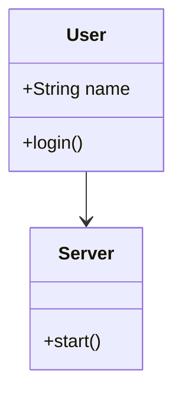

# OmniBoard Markdown 渲染与交互实现方案

## 1. 目标

为 OmniBoard 增加 Markdown 文档元素，支持 Markdown/GFM、表格、代码块、图片、数学公式、Mermaid 图表，以及类图、时序图、流程图、状态图、ER 图等。

同时支持：
- 白板中直接预览
- 双击进入编辑
- 源码 + 实时预览
- Resize / Move / Copy / Delete
- Undo / Redo
- 全屏阅读
- 白板缩放
- 与现有 Element / Sync / Theme 基础设施兼容

第一阶段只实现 Markdown 功能，不实现动态 DLL/SO 插件系统。

## 2. 总体架构

不要把 Markdown 直接转成 PNG。采用：

```text
Markdown Source
      ↓
Markdown Parser
      ↓
Document AST
      ↓
OmniBoard Render AST
      ├── TextNode
      ├── HeadingNode
      ├── ParagraphNode
      ├── ListNode
      ├── TableNode
      ├── CodeNode
      ├── MathNode
      ├── MermaidNode
      └── ImageNode
      ↓
Layout Engine
      ↓
Flutter Renderer
```

Markdown Source 是唯一真实数据；AST、Layout、Render Scene 都是可重建的派生数据。

## 3. Markdown Element

类型：

```text
type = "markdown"
```

示例：

```json
{
  "id": "markdown-001",
  "type": "markdown",
  "version": 1,
  "x": 100,
  "y": 100,
  "width": 800,
  "height": 600,
  "data": {
    "source": "# Hello\n\nThis is Markdown."
  }
}
```

核心数据：

```text
MarkdownElement
├── id
├── type
├── version
├── bounds
└── data
    └── source
```

可扩展 options：theme、allowHtml、math、mermaid 等。

## 4. Markdown AST

至少支持：

```text
DocumentNode
├── HeadingNode
├── ParagraphNode
├── TextNode
├── EmphasisNode
├── StrongNode
├── LinkNode
├── ListNode
├── ListItemNode
├── QuoteNode
├── CodeNode
├── CodeBlockNode
├── TableNode
├── ImageNode
├── MathInlineNode
├── MathBlockNode
├── MermaidNode
└── HorizontalRuleNode
```

Math 和 Mermaid 必须作为独立节点。

## 5. Mermaid

Markdown 示例：

````markdown

````

解析：

```text
MermaidNode
├── diagramType
└── source
```

渲染：

```text
Mermaid Source
      ↓
Mermaid Parser
      ↓
Diagram AST
      ↓
Diagram Layout
      ↓
Diagram Scene
      ↓
Flutter Canvas
```

第一阶段至少支持：

- flowchart
- classDiagram
- sequenceDiagram
- stateDiagram-v2
- erDiagram

架构上使用独立的 DiagramRenderer，不要把各种图表写死在 Markdown Renderer 中。

## 6. 数学公式

Inline：

```markdown
这是一个公式 $E=mc^2$。
```

Block：

```markdown
$$
E = mc^2
$$
```

采用：

```text
LaTeX Source
 ↓
Math Parser
 ↓
Math AST
 ↓
Math Layout
 ↓
Flutter Renderer
```

不要使用低质量 PNG 作为公式的主要渲染方式。

## 7. 代码块和表格

代码块支持语言识别、语法高亮、等宽字体、横向滚动和长代码处理。

Markdown 表格第一阶段只读显示，后续再考虑与现有 Table Element 转换。

## 8. 三种 UI 状态

```text
Preview
Editing
Fullscreen
```

### Preview

默认状态。白板中显示最终渲染结果，不显示源码。

单击后显示选择框和 Context Toolbar：

```text
[编辑] [全屏] [复制] [删除] [...]
```

### Editing

双击 Markdown 进入编辑。不要打开普通系统 Dialog，直接在白板上进入 Markdown 编辑器。

推荐左右分栏：

```text
┌──────────────────────────┬───────────────────────┐
│ Markdown Source           │ Live Preview          │
│                          │                       │
│ # 系统架构               │ # 系统架构            │
│                          │                       │
│ ```mermaid               │       Diagram         │
│ flowchart TD             │                       │
│ A --> B                  │                       │
│ ```                      │                       │
└──────────────────────────┴───────────────────────┘
```

支持 Markdown、Mermaid、LaTeX 语法高亮，以及常用编辑快捷键。

输入变化采用 debounce，建议初始 300ms。

### Fullscreen

进入独立 Markdown Reader，而不是简单放大白板 Element。

支持：
- 滚动
- 缩放
- Mermaid 图表放大
- 图片查看
- 搜索
- 编辑
- 目录
- 退出全屏

退出后恢复原来的白板位置和 Camera 状态。

## 9. Mermaid 交互

Mermaid 是独立 RenderNode。

单击 Mermaid 后显示：

```text
[编辑图表] [放大] [复制] [...]
```

点击编辑图表进入：

```text
┌──────────────────────┬────────────────────────┐
│ Mermaid Source       │ Preview                │
│                      │                        │
│ classDiagram         │      Diagram           │
│ class User {         │                        │
│   +login()           │                        │
│ }                    │                        │
└──────────────────────┴────────────────────────┘
```

## 10. 尺寸与缩放

Markdown Element 支持 Resize、Auto Height 和 Fixed Height。

Resize 后重新布局：

```text
width 800
 ↓
width 500
 ↓
文本重新换行
 ↓
Mermaid 重新布局
 ↓
公式重新布局
```

白板缩放使用：

```text
Logical Coordinates
 ↓
Markdown Layout
 ↓
Canvas Transform
 ↓
Screen
```

Canvas Zoom 不应该导致 Markdown Parser 重新执行。

## 11. Render Cache

建议：

```text
MarkdownRenderCache
├── sourceHash
├── markdownAST
├── renderAST
├── layout
└── renderScene
```

以下操作不应触发 Markdown Parser：
- 拖动 Element
- 移动 Canvas
- Canvas Zoom
- 选择 Element
- 取消选择

只有 source、width、theme 等影响布局的因素变化时才重新布局。

## 12. Undo / Redo / Sync

Markdown 不实现自己的白板 Undo/Redo，复用 OmniBoard 现有机制。

同步只需要真实数据：

```text
type
id
bounds
data.source
```

不要同步 HTML、Render AST、Layout、PNG、Canvas Path 等派生数据。

## 13. 与现有 Renderer 集成

第一阶段可以在现有 Renderer 增加 Markdown 分支，但实际实现必须独立：

```text
MarkdownElement
MarkdownParser
MarkdownRenderTree
MarkdownLayout
MarkdownPainter
MarkdownEditor
MarkdownReader
```

不要把全部 Markdown 逻辑继续写进 `professional_painter.dart`。

## 14. 推荐逻辑目录

根据 OmniBoard 当前目录结构调整，不要机械创建重复架构：

```text
markdown/
├── model/
├── parser/
│   ├── markdown_parser
│   ├── math_parser
│   └── mermaid_parser
├── render/
│   ├── markdown_renderer
│   ├── markdown_layout
│   ├── markdown_painter
│   ├── math_renderer
│   └── mermaid_renderer
├── editor/
├── reader/
└── widgets/
```

## 15. 第一阶段暂不实现

- 动态 DLL/SO 插件
- Flutter 动态插件加载
- Markdown 与 Table Element 自动转换
- Markdown 专用 CRDT
- Mermaid 图元拆解成独立白板 Element
- Markdown 内部元素独立拖动
- 服务端 Markdown 解析
- HTML/PDF 导出

## 16. 第一阶段必须完成

### Markdown
- 标题
- 段落
- 粗体
- 斜体
- 删除线
- 列表
- 引用
- 链接
- 分割线
- 表格
- 图片
- 代码块
- 行内代码

### Math
- Inline Math
- Block Math
- 常用 LaTeX

### Mermaid
- flowchart
- classDiagram
- sequenceDiagram
- stateDiagram
- erDiagram

### 白板交互
- 创建
- 单击选择
- 双击编辑
- 实时预览
- resize
- move
- delete
- copy
- undo
- redo
- fullscreen
- exit fullscreen

## 17. 工具栏

在现有 OmniBoard 工具栏增加 Markdown。

点击后创建 Markdown Element，默认内容：

```markdown
# Markdown

开始编辑...
```

创建后自动选中。

## 18. Context Toolbar

选中 Markdown：

```text
[编辑] [全屏] [复制] [删除] [...]
```

编辑状态：

```text
[保存] [取消] [预览] [全屏]
```

保存就是更新 Element source。

## 19. 状态机

```text
Preview
   │ 双击
   ▼
Editing
   │ 完成编辑
   ▼
Preview

Preview
   │ Fullscreen
   ▼
Fullscreen
   │ Exit
   ▼
Preview
```

## 20. 错误处理

解析错误不能导致白板崩溃。

例如 Mermaid：

```text
┌───────────────────────────────┐
│ Mermaid                       │
│                               │
│ Unable to render diagram      │
│ Syntax error at line 5        │
└───────────────────────────────┘
```

必须保留原始 source，用户仍然可以编辑。

## 21. 主题与安全

支持 Light/Dark，使用 `MarkdownTheme` 统一管理背景、前景、标题、链接、代码、边框、引用、表格、公式和图表样式。

默认关闭任意 HTML/Script 执行，不允许 Mermaid 执行任意 JavaScript。

## 22. 测试

Parser、Mermaid、Render、Interaction 均需要单元/集成测试。

重点覆盖：
- 空文档
- 长文档
- 大型 Mermaid
- 多公式
- 宽表格
- 长代码
- 混合内容
- 创建/选择/移动/Resize/编辑/预览/全屏/删除/Undo/Redo/Copy

性能测试：
- 1000 行 Markdown
- 100 个公式
- 20 个 Mermaid 图
- 10 个大型 Mermaid 类图
- 10000 字符代码块

要求拖动、Zoom、Selection 不重新 Parse，Preview 不阻塞 UI Thread。

## 23. 实现顺序

### Phase 1
Markdown Element：create / display / select / move / resize / delete / copy

### Phase 2
Markdown Parser + Render AST

### Phase 3
Heading / Paragraph / List / Table / Code / Image

### Phase 4
Inline Math / Block Math

### Phase 5
Mermaid：flowchart / classDiagram / sequenceDiagram / stateDiagram / erDiagram

### Phase 6
Source Editor + Live Preview

### Phase 7
Fullscreen Reader

### Phase 8
Undo / Redo / Copy / Sync / Theme

### Phase 9
Cache / Debounce / Incremental Update / Background Parse/Layout

## 24. 验收标准

完整流程：

```text
打开 OmniBoard
 ↓
点击 Markdown
 ↓
创建 Markdown Element
 ↓
双击
 ↓
进入编辑模式
 ↓
输入 Markdown
 ↓
右侧实时显示
 ↓
输入数学公式
 ↓
公式正常显示
 ↓
输入 Mermaid classDiagram
 ↓
类图正常显示
 ↓
输入 Mermaid sequenceDiagram
 ↓
时序图正常显示
 ↓
退出编辑
 ↓
回到白板 Preview
 ↓
移动 / Resize
 ↓
内容正常重新布局
 ↓
点击 Fullscreen
 ↓
进入全屏阅读模式
 ↓
放大 / 滚动
 ↓
退出全屏
 ↓
回到原来的白板位置
```

## 25. 核心架构约束

> Markdown source 是唯一真实数据；AST、Layout、Render Scene 都是可重建缓存。

> Markdown、数学公式、Mermaid 必须在渲染层保持独立节点。

> Preview、Editing、Fullscreen 是同一个 Markdown Element 的不同 UI 状态，而不是三个不同的数据对象。

> 优先复用 OmniBoard 现有 Element、Selection、Resize、Undo/Redo、Canvas、Theme 等基础设施。

> 第一阶段不要实现动态插件系统，先把 Markdown 渲染与交互完整实现。

> 实现前先阅读 OmniBoard 当前源码，确认实际类名、目录和数据流，再选择最小侵入式改造方案。
